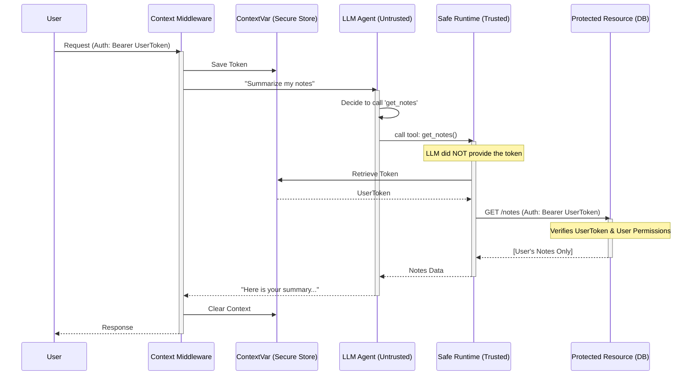

# OBO Authnz Framework for LLM Applications

A framework for implementing secure, **On-Behalf-Of (OBO)** authentication and authorization in modern LLM-powered applications.

## The Core Idea

Current LLM architectures usually provide the LLM backend with full "God Mode" access to resources (databases, APIs, etc.) via service accounts. This creates a massive security hole: if an LLM is tricked via prompt injection, it can access *any* data the service account has permission to see, regardless of which user is asking.

This project implements an **OBO Architecture**: When an LLM Agent requests a resource, it does so **on behalf of the user**, inheriting exactly that user's permissions and protecting the application from unauthorized access.

---

## Architecture

The framework relies on a **Middleware + Runtime Injection** pattern that decouples Sensitive Identity (Tokens) from the Untrusted Reasoning Engine (LLM).

### Key Components

1.  **Context Middleware (The Binder)**: Sits at the API edge. It extracts the User Identity (Auth Token) from the request and binds it to a secure, thread-isolated context (`contextvars`).
2.  **Safe Runtime (The Executor)**: A trusted execution environment that intercepts LLM Tool Calls. Before execution, it retrieves the bound token from the secure context and injects it into the outbound request.
3.  **Untrusted LLM (The Brain)**: The reasoning engine (e.g., Gemini). It decides *what* to do (e.g., "fetch my notes"), but it **never sees or handles the Auth Token**.
4.  **Resource Guard (The Target)**: The protected resource (Notes API, Database) that enforces RBAC based on the injected OBO token.

### Security Design Flow (Example)



---

## Example Implementation

### 1. Secure Context Binding
We use Python's `contextvars` to ensure that the user's identity is isolated per request, even in asynchronous environments.

```python
# context.py
_current_user_token = ContextVar("current_user_token", default=None)

def set_current_user_id(user_id: str):
    _current_user_token.set(user_id)
```

### 2. Transparent Token Injection
The `SafeToolExecutor` is the only component that handles the actual outbound communication. It automatically pulls the identity from the context.

```python
# llm_agent.py (Simplified)
async def list_notes_tool():
    user_id = get_current_user_id() # Injected automatically from context
    async with AsyncSessionLocal() as db:
        service = NotesService(db, user_id)
        return await service.get_my_notes() # Enforces RBAC
```

### 3. Resource Enforcement
The resource (API/Database) performs standard RBAC. Because the token is injected at the runtime level, the resource sees the **User's Identity**, not the LLM Service's identity.

---

## Example Application: OBO Notes

Located in `obo_example_app/`, this is a full implementation featuring:
- **FastAPI** backend with OBO Middleware.
- **SQLite** persistence with row-level ownership.
- **Google Gemini** integration for natural language note management.
- **Simple UI** to simulate multi-user environments.

### Running the Example

1. **Install Dependencies**:
   ```bash
   pip install -r obo_example_app/requirements.txt
   ```

2. **Set Gemini API Key**:
   ```bash
   export GEMINI_API_KEY="your_api_key_here"
   ```

3. **Configure Path & Run**:
   ```bash
   export PYTHONPATH=$PYTHONPATH:$(pwd)/obo_example_app/src
   python3 -m uvicorn obo_example_app.main:app --reload
   ```

> **Note:** The example application is an extremely simplified implementation for the PoC. The specific implementation will vary based on how the LLM is integrated into the application. I'll update the obo_prototype to be a more complete library which can be used in more complex applications.

---

## Security Advantages

| Aspect | Legacy LLM Apps | OBO Authnz Framework |
| :--- | :--- | :--- |
| **Service Permissions** | Full DB Access via Service Account | Delegate (User-Scoped) |
| **Prompt Injection Risk** | High (Can access other user's data) | Low (Restricted to current user's data) |
| **Token Safety** | LLM sees tokens (High risk) | LLM never sees tokens (Zero-Trust) |
| **Audit Log** | "Service Account X accessed Row Y" | "User A accessed Row Y (via Agent)" |
| **Implementation Effort** | Low (Provide Service Account) | Medium (Implement Middleware & Runtime) |
